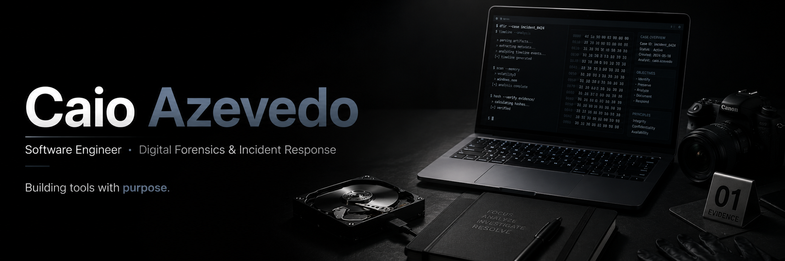

 

## Sobre

Estudante de Engenharia de Software no IBMEC-RJ.
Aprendendo em público, cada commit é um passo.

 

## Tecnologias

 

## Projetos

| Projeto | Descrição | Tecnologia |
|---|---|---|
| [exif-extractor](https://github.com/azvdcaio/exif-extractor) | Extrai metadados forenses de imagens |  |

 

## Atividade

